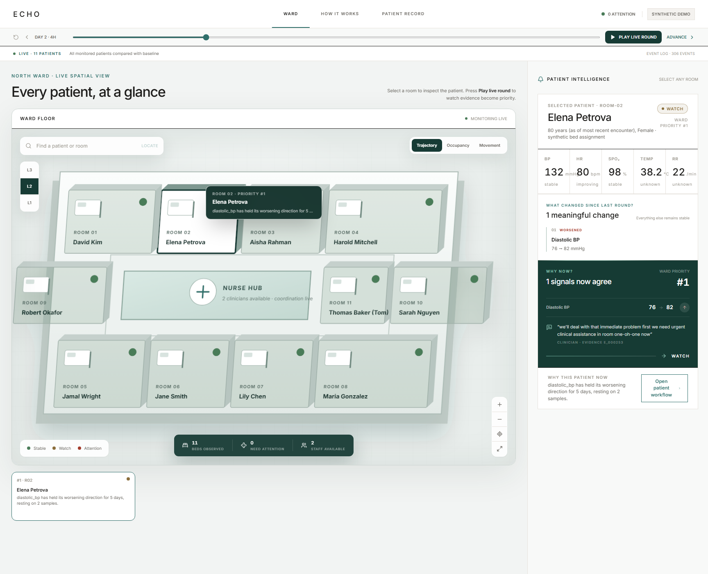

<div align="center">

# ECHO

### Every Clinical Observation

**Most clinical systems remember events. ECHO remembers trajectories.**

ECHO is a longitudinal ward command center that turns routine nursing observations into replayable patient memory, waits for persistent or corroborated change, and prepares the next care action for human approval.

[](#prototype-boundaries)
[](#corti-integration)
[](#evidence-it-works)
[](#quick-start)

[Quick start](#quick-start) · [Run the demo](#the-five-minute-demo) · [Architecture](#how-it-works) · [Validation](docs/VALIDATION.md) · [Technical spec](docs/SPEC.md)

</div>

<p align="center">
  
</p>

> **Synthetic clinical prototype.** Every patient, device reading, staff record, and appointment slot in the demo is synthetic. ECHO is not a medical device and must not be used for clinical decisions.

## The problem

Ward observations are usually stored as isolated readings and notes. A blood pressure taken today rarely carries the context of the same patient's baseline, direction of travel, repeated observations, and unresolved follow-up into the next shift.

Simple threshold alerts do not solve this: they react to snapshots, create noise, and struggle to explain why attention is justified *now* but was not justified one observation earlier.

ECHO treats every observation as part of a trajectory. It remembers first, waits for enough evidence, and escalates only when deterministic rules identify persistence, multi-signal agreement, a care gap, or an explicit emergency condition.

## What ECHO does

The product follows the nurse's existing workflow instead of asking them to trigger an AI alert.

- **Builds longitudinal memory** — speech, vitals, facts, and actions enter one append-only patient event history.
- **Separates noise from deterioration** — one observation updates history; repeated and agreeing signals move a patient through `GREEN → WATCH → PERSISTING_CONCERN → HIGH → CRITICAL`.
- **Explains every priority change** — the queue exposes what changed, why it matters, why now, why not earlier, and the exact supporting events.
- **Finds care gaps** — overdue observations, missing reassessments, and rising priority without coordination become visible work.
- **Prepares—not executes—the next action** — ECHO checks fixture-backed staff and slot availability, prepares a reassessment or escalation, and waits for a human to approve or reject it.
- **Replays the truth at any moment** — projections can be reconstructed at time `T`, making the complete decision path auditable.

### The magic moment

ECHO's strongest behavior is restraint. A single concerning reading becomes memory, not an alert. When later observations persist and agree, the same patient rises to the top of the ward with a receipt showing exactly which evidence crossed the gate.

## How it works

```mermaid
flowchart LR
    Nurse["Nurse or clinician"] --> UI["Next.js ward UI<br/>ward · patient · live demo"]
    UI --> API["Node API<br/>same-origin HTTP"]
    API --> Log["Append-only event log<br/>source of truth"]
    Log --> History["Patient history<br/>evidence-backed facts"]
    History --> Trends["Deterministic trends<br/>baseline · delta · persistence"]
    History --> Gaps["Care-gap projection<br/>deadlines · missing response"]
    Trends --> Priority["Priority engine<br/>explicit gates and rules"]
    Gaps --> Priority
    Priority --> Queue["Attention queue<br/>Why now · Why not earlier"]
    Queue --> Agent["Constrained proposal agent"]
    Agent --> Coordination["Demo coordination adapter<br/>staff · workload · slots"]
    Agent -. "optional wording" .-> Corti["Corti<br/>Streams · Facts · Coding · Documents"]
    Coordination --> Proposal["Prepared action"]
    Corti --> Proposal
    Proposal --> Human{"Human decision"}
    Human -->|approve or reject| API
    UI -->|microphone audio| API
    API -->|live clinical capture| Corti
    Corti -->|transcript · facts · codes| Log
```



The event log is the only source of truth. Patient history, trends, priority, care gaps, proposals, and ward state are projections from events at an explicit time. Corti enriches the record; deterministic TypeScript owns clinical state; a human owns workflow-changing decisions.

## Key engineering decisions

### Event sourcing instead of mutable dashboard state

Observations and decisions are appended as events. Replaying events through time `T` reproduces the same patient and ward state, including the evidence available at that moment.

### Patient-specific trajectories instead of population-only thresholds

The trend engine evaluates each patient's baseline, current value, delta, direction, rate, persistence, missing observations, and agreement across signals. Priority is a transparent sum of evidence-backed components, not an opaque model score.

### Deterministic clinical logic around AI

Corti performs clinical capture, fact extraction, coding, and optional text generation. It does not decide whether a patient is deteriorating. Speaker attribution and grounding gates also refuse unsupported facts rather than silently guessing.

### Auto-prepare, never auto-book

The proposal layer may prepare reassessment, review, or escalation work. It cannot silently change the workflow: approval and rejection both become auditable action events.

### Presenter-safe fallback

The golden ward simulation is deterministic and works without network access. The live microphone path uses Corti when credentials are configured; the recorded path is visibly labeled as a fallback and never pretends to be live.

## Corti integration

ECHO uses Corti as its only clinical AI provider:

- **Streams and transcription** for browser-microphone clinical capture
- **Facts** for interaction-scoped structured clinical facts
- **Medical Coding** for evidence-linked clinical codes
- **Documents / Text Generation** for optional workflow phrasing

Credentials stay in the Node server. Cached or deterministic adapters keep the core demo available when the live service is unavailable, and the UI reports which path produced the result.

## Technology

| Layer | Technology | Responsibility |
| --- | --- | --- |
| Interface | Next.js 15, React 19, TypeScript, Tailwind CSS | Ward command center, patient story, replay, live causal demo |
| API host | Node.js HTTP server | Serves the static client and constrained JSON endpoints on one port |
| Clinical core | Pure TypeScript engines and rule tables | Baselines, trends, persistence, priority, care gaps, replay |
| Clinical AI | Corti APIs | Streams, transcription, facts, coding, and document generation |
| Coordination | Narrow fixture-backed adapter | Staff availability, workload, and proposed appointment slots |
| Storage | In-memory append-only event log; optional JSONL mirror | Deterministic history and exact replay for the prototype |
| Verification | Node test runner, TypeScript, Next.js build | Unit, integration, acceptance, replay, and build validation |

## Quick start

### Requirements

- Node.js 22 or newer
- npm

Install both Node projects, verify the complete repository, and start the single-process demo:

```bash
git clone https://github.com/syedwajiulhassan715-rgb/Corti-Hackathon.git
cd Corti-Hackathon

npm ci
npm --prefix web-next ci
npm run verify
npm start
```

Open **http://localhost:8787/ward/**.

The deterministic recorded demo does not require credentials. To enable the live microphone-to-Corti path:

```bash
cp .env.example .env
```

Then provide these values in `.env`:

```dotenv
CORTI_TENANT_NAME=
CORTI_CLIENT_ID=
CORTI_CLIENT_SECRET=
CORTI_ENVIRONMENT=
```

Do not commit `.env`. The server also accepts `PORT` to change the default port and `ECHO_LOG` to seed events from a JSONL log.

## The five-minute demo

### Deterministic golden path

1. Open `/ward/` and select **Reset** for a known starting state.
2. Inspect Elena Petrova in room 02. Her historical observations establish a personal baseline.
3. Select **Play live round** or advance the four-hour steps manually.
4. Watch a first change enter history without a premature high-priority alert.
5. Continue advancing as multiple signals persist and agree. Elena climbs from `WATCH` to `PERSISTING_CONCERN` to `HIGH` and becomes ward priority `#1`.
6. Open the patient workflow to inspect **What changed**, **Why now**, **Why not earlier**, and the cited events.
7. Review the prepared action, then approve or reject it. The decision becomes a new timeline event.
8. Scrub backward to verify that ECHO reconstructs the earlier state exactly.

### Live Corti path

Open **http://localhost:8787/demo/live/**. Choose **Start live encounter** for browser microphone → Corti Streams, or choose the clearly labeled **recorded fallback** for the deterministic causal walkthrough.

Useful routes:

| Route | Purpose |
| --- | --- |
| `/ward/` | Ward attention queue, spatial view, replay, and presenter controls |
| `/patients/elena_petrova/` | Standalone longitudinal patient view |
| `/demo/live/` | Live or recorded encounter-to-action pipeline |
| `/health` | Process health and current event count |

## Evidence it works

The repository currently passes **390 automated tests** plus the production static build.

| Verified behavior | Repository evidence |
| --- | --- |
| One concerning reading does not escalate above `WATCH` | Priority acceptance and rule tests |
| Persistent multi-signal deterioration climbs the ladder | End-to-end acceptance and trajectory tests |
| Transient changes can resolve without sustained escalation | Deterministic ward simulation tests |
| Every priority component cites supporting event IDs | Prioritization and acceptance tests |
| Missing observations and reassessments create care gaps | Care-gap projection tests |
| Staff scarcity and invalid coordination calls degrade safely | Coordination adapter tests |
| Approval is required and produces an action event | Proposal, server, and replay tests |
| Replay to time `T` is deterministic and excludes later events | Event-log and replay tests |
| Corti failures fall back without crashing the golden path | Corti cache, generation, and transcription tests |
| Duplicate retries do not duplicate recorded-demo actions | Server integration tests |

Run the same validation locally:

```bash
npm run verify
```

For the recorded integration notes—including real Corti transcript, coding, and tenant capability checks—see [`docs/VALIDATION.md`](docs/VALIDATION.md).

## Repository map

```text
Corti-Hackathon/
├── src/
│   ├── contracts/      # Typed events, clinical state, care gaps, and actions
│   ├── log/            # Append-only store and deterministic replay
│   ├── world/          # Synthetic charts, feeds, roster, and chart parsing
│   ├── pipeline/       # Observation extraction, attribution, and grounding
│   ├── engines/        # Trends, priority, contradictions, and rule tables
│   ├── projections/    # Patient history, ward state, and care gaps
│   ├── agents/         # Constrained action proposals and human decisions
│   ├── mcp/            # Narrow fixture-backed coordination boundary
│   ├── corti/          # Corti auth, Streams, Facts, Coding, Documents, cache
│   ├── simulation/     # Deterministic ward and encounter scenarios
│   └── server/         # Node API and static web host
├── web-next/           # Next.js command center and live demo
├── fixtures/           # Synthetic and supplied hackathon fixtures
├── docs/               # Product, clinical, architecture, and validation notes
├── tools/              # Local validation and capture utilities
└── package.json        # Root verification and runtime scripts
```

## Prototype boundaries

Already implemented:

- Deterministic longitudinal history, trends, priority, care gaps, and replay
- A ward-wide attention queue with evidence-linked explanations
- Live and recorded encounter paths with explicit provenance
- Constrained action preparation followed by human approval or rejection
- Offline deterministic fixtures for a reliable golden demo

Not yet production infrastructure:

- The coordination adapter uses fixture data; it is not connected to a hospital scheduling system.
- The event log is in memory with optional JSONL persistence; there is no production database.
- Authentication, authorization, EHR integration, clinical validation, and deployment hardening are future work.
- Clinical thresholds and scenarios are prototype rules over synthetic data, not validated care protocols.

## What comes next

1. Validate the deterministic rule tables with clinical and human-factors experts.
2. Replace fixture coordination with authenticated, least-privilege operational tools.
3. Add durable event storage, access control, audit retention, and deployment observability.
4. Evaluate alert restraint, explanation usefulness, and workflow impact in a controlled simulation study.

## Documentation

- [`docs/SPEC.md`](docs/SPEC.md) — current product and acceptance specification
- [`docs/DECISIONS.md`](docs/DECISIONS.md) — architectural and product decisions
- [`docs/CLINICAL.md`](docs/CLINICAL.md) — prototype clinical rules and boundaries
- [`docs/CONTRACTS.md`](docs/CONTRACTS.md) — event and module contracts
- [`docs/VALIDATION.md`](docs/VALIDATION.md) — Corti experiments and validation record
- [`ATTRIBUTIONS.md`](ATTRIBUTIONS.md) — fixture and visual attributions

---

<p align="center">
  <strong>ECHO remembers the patient's trajectory—and keeps the human in control of the care loop.</strong><br>
  <sub>Hackathon prototype · synthetic data · not a medical device</sub>
</p>
